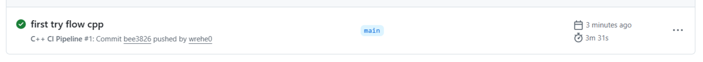
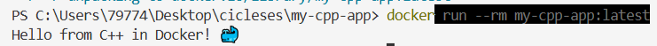

## Pipeline CI на C++ в GitHub Actions

**Цель** — учебный пример — простой проект, который можно склонировать, настроить и убедиться, что приложение в контейнере на **С++**, и **GitHub Actions** работает

Вы научитесь:
- Настроить **CI** для **C++** проектов
- Понять взаимодействие CMake, Google Test и GitHub Actions
- Научиться контейнеризировать приложения с Docker
- Сборку Docker-образа
- Сохранение артефактов для локального использования

### 1. Создайте на **GitHub** новый публичный репозиторий `my-cpp-app` с `README.md`

Склонируйте его себе, откройте в **VS Code** и создайте такую структуру будущего проекта:

Структура проекта
```
my-cpp-app/
├── .github/
│   └── workflows/
│       └── ci.yml
├── src/
│   └── main.cpp
├── tests/
│   └── test.cpp
├── CMakeLists.txt
├── Dockerfile
├── .dockerignore
└── README.md
```

Структуру проекта можно сделать одной **bash**-командой, которая автоматически создаст все файлы и каталоги проекта:
```shell
mkdir -p .github/workflows src tests && \
touch .github/workflows/ci.yml \
      src/main.cpp tests/test.cpp CMakeLists.txt \
      .dockerignore Dockerfile README.md
```

### 2. Файл `src/main.cpp`
```cpp
#include <iostream>
#include <string>

std::string getGreeting() { return "Hello from C++ in Docker! 🐳"; }

int main() {
  std::cout << getGreeting() << std::endl;
  return 0;
}
```

### 3. Файл `tests/test.cpp`
```cpp
#include <gtest/gtest.h>
#include <string>

std::string getGreeting() { return "Hello from C++ in Docker! 🐳"; }

TEST(GreetingTest, ReturnsCorrectString) {
  EXPECT_EQ(getGreeting(), "Hello from C++ in Docker! 🐳");
}

TEST(GreetingTest, ContainsKeywords) {
  std::string greeting = getGreeting();
  EXPECT_TRUE(greeting.find("C++") != std::string::npos);
  EXPECT_TRUE(greeting.find("Docker") != std::string::npos);
}

int main(int argc, char **argv) {
  ::testing::InitGoogleTest(&argc, argv);
  return RUN_ALL_TESTS();
}
```

### 4. Файл `CMakeLists.txt`
```cmake
cmake_minimum_required(VERSION 3.16)
project(MyCppApp)

set(CMAKE_CXX_STANDARD 17)
set(CMAKE_CXX_STANDARD_REQUIRED ON)

# Основное приложение
add_executable(my_app src/main.cpp)

# Unit-тесты (собираются только если явно включены)
option(BUILD_TESTS "Build unit tests" OFF)

if(BUILD_TESTS)
    find_package(GTest REQUIRED)
    add_executable(my_test tests/test.cpp)
    target_link_libraries(my_test GTest::gtest GTest::gtest_main)
    enable_testing()
    add_test(NAME MyTest COMMAND my_test)
endif()
```

### 5. Файл `Dockerfile`
```dockerfile
# ---- Этап 1: Сборка приложения ----
FROM ubuntu:22.04 AS builder

RUN apt-get update && apt-get install -y \
    build-essential \
    cmake \
    && rm -rf /var/lib/apt/lists/*

WORKDIR /app

# Копируем исходники и собираем
COPY CMakeLists.txt .
COPY src ./src

RUN mkdir build && cd build && \
    cmake .. -DBUILD_TESTS=OFF && \
    cmake --build . --target my_app

# ---- Этап 2: Минимальный образ для запуска ----
FROM ubuntu:22.04

# Устанавливаем runtime-зависимости
RUN apt-get update && apt-get install -y \
    libstdc++6 \
    && rm -rf /var/lib/apt/lists/*

# Создаём непривилегированного пользователя
RUN useradd --create-home appuser
WORKDIR /home/appuser

# Копируем скомпилированный бинарник
COPY --from=builder /app/build/my_app .

USER appuser

CMD ["./my_app"]
```

### 6. Файл `.dockerignore`

```dockerignore
build/
.git/
.github/
.gitignore
.dockerignore
*.md
*.log
Dockerfile
tests/
```

### 7. Файл `.github/workflows/ci.yml`
```yaml
name: C++ CI Pipeline

on:
  push:
    branches: [main, master]
  pull_request:
    branches: [main, master]
  workflow_dispatch:

env:
  BUILD_TYPE: Release
  IMAGE_NAME: my-cpp-app

jobs:
  # Job 1: Форматирование кода
  format:
    name: Format Code
    runs-on: ubuntu-latest
    steps:
      - name: Checkout code
        uses: actions/checkout@v4

      - name: Run clang-format
        uses: jidicula/clang-format-action@v4.13.0
        with:
          clang-format-version: "17"
          check-path: "src/"

  # Job 2: Сборка и тестирование
  build-and-test:
    name: Build & Test
    runs-on: ubuntu-latest
    needs: format
    steps:
      - name: Checkout code
        uses: actions/checkout@v4

      - name: Install dependencies
        run: |
          sudo apt-get update
          sudo apt-get install -y cmake libgtest-dev
          cd /usr/src/gtest
          sudo cmake CMakeLists.txt
          sudo make
          sudo cp lib/*.a /usr/lib

      - name: Configure CMake
        run: cmake -B build -DCMAKE_BUILD_TYPE=${{ env.BUILD_TYPE }} -DBUILD_TESTS=ON

      - name: Build all
        run: cmake --build build --config ${{ env.BUILD_TYPE }}

      - name: Run tests
        run: |
          cd build
          ctest -C ${{ env.BUILD_TYPE }} --output-on-failure

  # Job 3: Сборка Docker образа
  docker-build:
    name: Build Docker Image
    runs-on: ubuntu-latest
    needs: build-and-test
    steps:
      - name: Checkout code
        uses: actions/checkout@v4

      - name: Set up Docker Buildx
        uses: docker/setup-buildx-action@v3

      - name: Build Docker image
        uses: docker/build-push-action@v6
        with:
          context: .
          load: true
          tags: ${{ env.IMAGE_NAME }}:latest
          cache-from: type=gha
          cache-to: type=gha,mode=max

      - name: Save Docker image as artifact
        run: |
          docker save ${{ env.IMAGE_NAME }}:latest -o /tmp/docker-image.tar
          gzip /tmp/docker-image.tar

      - name: Upload Docker image artifact
        uses: actions/upload-artifact@v4
        with:
          name: docker-image
          path: /tmp/docker-image.tar.gz
          retention-days: 7

      - name: Test Docker image
        run: docker run --rm ${{ env.IMAGE_NAME }}:latest
```

### 8. Проверить сборку онлайн

- Закоммитьте и запушите в ветку `main` эти файлы в ваш репозиторий
- Перейдите на вкладку **Actions** в вашем репозитории на **GitHub**. Вы увидите, как ваш **Workflow** запустился, а через несколько минут загорится **зеленая** галочка, которая означает, что все шаги прошли успешно
- Если ваш **Workflow** стал красным - исправьте ошибки и запуштесь снова



### 9. Проверить сборку Docker-образа локально

```shell
docker build -t my-cpp-app:latest .
```
Запустить контейнер
```shell
docker run --rm my-cpp-app:latest
```



> Если вы обнаружили ошибку в этом тексте - сообщите пожалуйста автору!